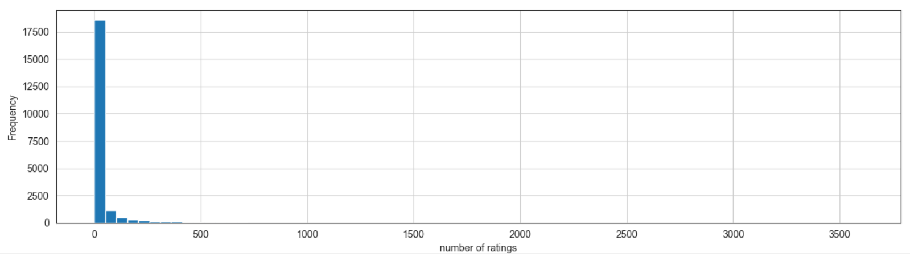
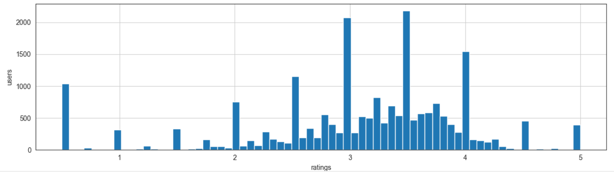
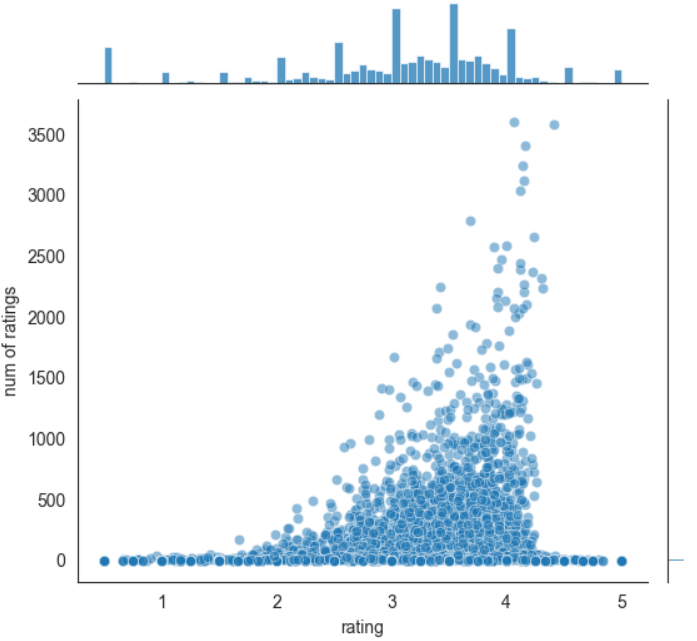

Movie Recommendation System - Python
==========================================================

Recommender system
------------------
A Recommender System or a Recommendation System is a subclass of information filtering system that seeks to predict the "rating" or "preference" a user would give to an item.
Recommender systems are utilized in a variety of areas including movies, music, news, books, research articles, search queries, social tags, and products in general.

The project is divided into three stages:
* Data Preprocessing
* Model Building
* Results Analysis
* Movie Recommendations

Data Visualizations
-------------------
* histogram - num_of_ratings   


* histogram - avg_rating_per_movie    


* joinplot - ratings & num_of_ratings   


* Movie recommendations based on ratings of other user   


Dataset
-------
It contains 100836 ratings and 3683 tag applications across 9742 movies. These data were created by 610 users between March 29, 1996 and September 24, 2018. This dataset was generated on September 26, 2018.

datasets: [kaggle dataset](https://grouplens.org/datasets/movielens/latest/)

Methodologies
-----------
- Collaborative filterinf - Item-Item
- Cosine Simmilarity
- Pearsons Correlation

Technologies
------------
- Matplotlib
- Pandas
- Numpy

Getting Started
----------------------
Clone the repository:

```bash
git clone https://gitlab.com/kashish10/movie-recommender-system.git
```
Install dependencies:
```bash
$ virtualenv MRS
$ source MRS/bin/activate
$ pip3 install -r requirements.txt
```
Go inside the folder :

```bash
cd movie-Recommendation-system
```
Run the python file
```bash
$ python3 Recommender Systems.py
```

Contributing
------------
Contributions are actively encouraged. Please review the code. If you find a bug, or any improvement please [email me](kashish.chaurasia10@gmail.com), submit a pull request or submit an issue.

